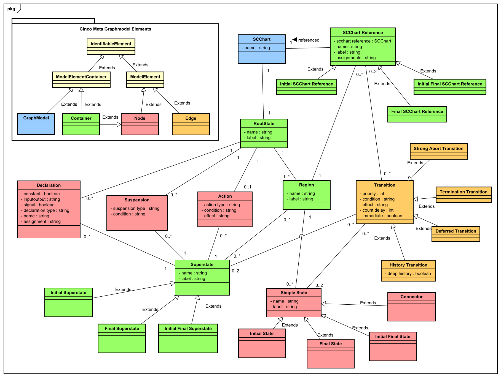

# Bachelor Thesis - A Graph Language for SCCharts

## Description
This project was developed as part of my Bachelor's thesis. The implemented editor allows modeling Sequentially Constructive Statecharts (SCChart), a visual programming language for safety-critical reactive systems. It is based on the Cinco Meta Tooling Framework, known for its main feature of fully generating graph-based modeling tools.

The image depicts the data structure of the SCChart language as well as the mapping of these elements onto Cinco's meta graph model elements.

The core of the editor consists of the *SCChart.mgl* file, where the components are defined, and the *SCChart.style* file, where the visual appearance is specified. Additionally, event hooks are implemented to react to changes when creating SCChart models. The generated models can be transformed into Java or C code using a code generator and the KIELER SCChart Compiler.

## Visuals
Depending on what you are making, it can be a good idea to include screenshots or even a video (you'll frequently see GIFs rather than actual videos). Tools like ttygif can help, but check out Asciinema for a more sophisticated method.

## Installation
-Java 11 requiered 
-Download [Cinco_2.0.1 for windows](https://cinco.scce.info/dwonload)
-Download [kicodia-win.bat](http://rtsys.informatik.uni-kiel.de/~kieler/files/nightly/sccharts/cli/kicodia-win.bat) and put in cinco-2.0.1/KILER_CLI here
-Start Cinco and create workspace
-Import porjects -> General/existing projeyt into workspace
-Select the *info.scce.cinco.product.scchart* folder
-Goto info.scce.cinco.product.scchart/model and select *Generate Cinco Product*
-After succesfully generation run as Eclipse Application
-Start Cinco and create a workspace
-Import projects by navigating to: Import -> Projects -> General/Existing Projects into Workspace
-Select the *info.scce.cinco.product.scchart* folder
-Go to info.scce.cinco.product.scchart/model and select Generate Cinco Product
-After successful generation, run as Eclipse Application
-Create new project and create new SCChart

## Links
Cinco Meta Tooling Suite project page: [https://cinco.scce.info/](https://cinco.scce.info/)

SCChart project page: [https://www.rtsys.informatik.uni-kiel.de/en/archive/kieler](https://www.rtsys.informatik.uni-kiel.de/en/archive/kieler)

## Project status
Completed
